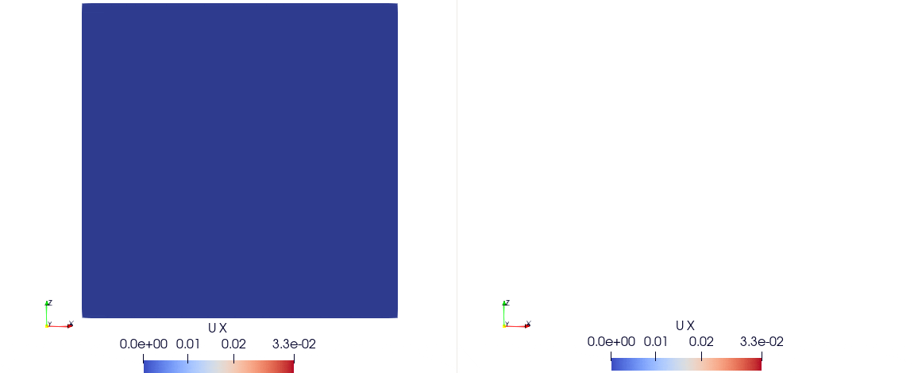
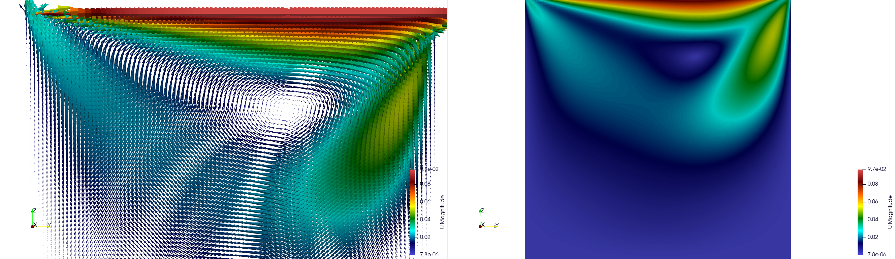

Examples
========

Poiseuille Flow
^^^^^^^^^^^^^^^

We define the simulation domain for the Lattice Boltzmann Method (LBM). In this example, we choose a resolution of 30×30×30. Periodic boundary conditions are applied along the XX and YY axes, while the ZZ axis remains non-periodic.

.. code-block:: yaml

   do_domain:
     - domain:
        bounds: [[0,0,0],[0.1,0.1,0.1]]
        resolution: 30
        periodic: [true, true, false]

We apply two Neumann boundary conditions on the Z axis, (setting to `(ux = 0, uy = 0, uz = 0)`):

.. code-block:: yaml

   boundary_conditions:
     - neumann_z_l:
        U: [0.0,0,0]
     - neumann_z_0:
        U: [0.0,0,0]

An external force of `(9.512485×10−5,0.0,0.0)` is applied to drive the flow. The kinematic viscosity is set to `1e−3`, and the average density is assumed to be `1000`.

.. code-block:: yaml

   set_lbm_parameters:
     - lbm_parameters:
        Fext: [9.512485e-05,0.000000e+00,0.000000e+00]
        nuth: 1e-3

The global parameters for this simulation include output frequency and the total number of iterations:

.. code-block:: yaml

   global:
      simulation_paraview_freq: 100
      simulation_end_iteration: 3000

The expected results should show the development of a fully developed Poiseuille flow profile along the Z axis, with velocity increasing towards the center and decreasing near the boundaries due to the imposed Neumann conditions.

Couette Flow
^^^^^^^^^^^^

We define the simulation domain for the Couette flow using the Lattice Boltzmann Method (LBM). In this case, we set the resolution to 100×100×100, with periodic boundary conditions applied on the XX and YY axes, and non-periodic boundary on the ZZ axis.

.. code-block:: yaml

   do_domain:
     - domain:
        bounds: [[0,0,0],[0.1,0.1,0.1]]
        resolution: 100
        periodic: [true, true, false]

We set the Lattice Boltzmann parameters with a kinematic viscosity (`nuth`) of `1e-2` and no external force applied (i.e., `Fext = [0, 0, 0]`).

.. code-block:: yaml

   set_lbm_parameters:
     - lbm_parameters:
        Fext: [0.000000e+00,0.000000e+00,0.000000e+00]
        nuth: 1e-2

Boundary conditions are applied on the Z axis. On the lower boundary (`neumann_z_l`), the velocity is set to `U = [0.001, 0, 0]`.

.. code-block:: yaml

   boundary_conditions:
     - neumann_z_l:
        U: [0.001,0,0]

Global parameters for the simulation are defined, including the initial timestep and physical time, with the simulation set to run for 100 iterations.

.. code-block:: yaml

   global:
   global:
      simulation_paraview_freq: 100
      simulation_end_iteration: 3000

The expected results will show a linear velocity profile along the Z axis, where the velocity increases linearly from the stationary bottom boundary to the top boundary with a constant shear rate, characteristic of Couette flow.

.. image:: ../_static/couette.gif
   :align: center

Cavity Flow
^^^^^^^^^^^

We define the simulation domain for the cavity flow using the Lattice Boltzmann Method (LBM). In this case, the resolution is set to 200×200×200, with non-periodic boundary conditions applied in all directions (XX, YY, and ZZ).

.. code-block:: yaml

   do_domain:
     - domain:
        bounds: [[0,0,0],[0.1,0.1,0.1]]
        resolution: 200
        periodic: [false, false, false]

We set the Lattice Boltzmann parameters, with no external force applied (i.e., `Fext = [0, 0, 0]`) and a kinematic viscosity (`nuth`) of `1e-4`.

.. code-block:: yaml

   set_lbm_parameters:
     - lbm_parameters:
        Fext: [0.000000e+00,0.000000e+00,0.000000e+00]
        nuth: 1e-4

The boundary conditions for the simulation are defined as follows:
- **Pre-streaming boundary conditions**: The `pre_bounce_back` and `cavity_z_l` conditions are set, with a velocity of `U = [0.0, 0.1, 0]` applied on the lower Z boundary.
- **Post-streaming boundary condition**: The `post_bounce_back` condition is applied on the other boundaries.

.. code-block:: yaml

   pre_stream_bcs:
     - pre_bounce_back
     - cavity_z_l:
        U: [0.0, 0.1, 0]

   post_stream_bcs:
     - post_bounce_back

Global parameters for the simulation are set, including the frequency for output data (`simulation_paraview_freq`) and the total number of iterations (`simulation_end_iteration`).

.. code-block:: yaml

   global:
      simulation_paraview_freq: 50
      simulation_end_iteration: 1000

The expected results will show the development of a cavity flow pattern, where the fluid moves along the Z axis, influenced by the velocity set on the lower boundary. This is typical for cavity simulations, where the fluid is confined within a box.

