Examples
========

Poiseuille Flow
^^^^^^^^^^^^^^^

We define the simulation domain for the Lattice Boltzmann Method (LBM). In this example, we choose a resolution of 30×30×30. Periodic boundary conditions are applied along the XX and YY axes, while the ZZ axis remains non-periodic.

.. code-block:: yaml

   do_domain:
     - domain:
        bounds:    [ [0,0,0] , [0.1,0.1,0.1] ]
        cell_dims: [ 30 , 30 , 30 ]
        periodic:  [ true, true, false ]

We apply a Neumann boundary condition on both Z boundaries at once, via the ``regions`` parameter (setting to `(ux = 0, uy = 0, uz = 0)`):

.. code-block:: yaml

   boundary_conditions:
     - neumann:
        U: [0.0,0,0]
        regions: [plan_xy_0, plan_xy_l]

An external force of `(9.512485×10−5,0.0,0.0)` is applied to drive the flow. The kinematic viscosity is set to `1e−3`, and the average density is assumed to be `1000`.

.. code-block:: yaml

   set_lbm_parameters:
     - lbm_parameters:
        Fext: [9.512485e-05,0.000000e+00,0.000000e+00]
        nuth: 1e-3

The global parameters for this simulation include output frequency and the total number of iterations:

.. code-block:: yaml

   global:
      simulation_paraview_freq: 100
      simulation_end_iteration: 3000

The expected results should show the development of a fully developed Poiseuille flow profile along the Z axis, with velocity increasing towards the center and decreasing near the boundaries due to the imposed Neumann conditions.

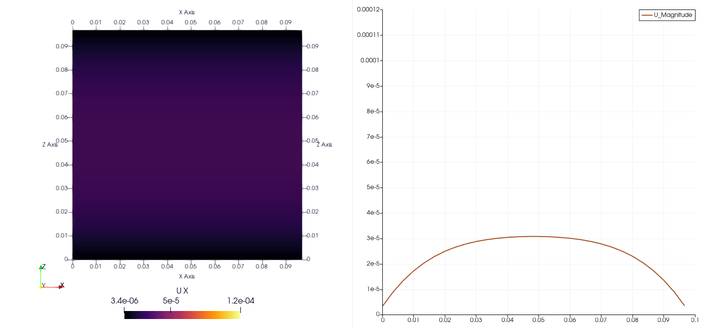

The velocity profile along the Z axis, once the flow is fully developed, is shown below:

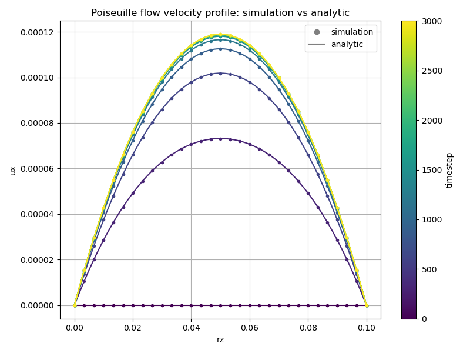

Couette Flow
^^^^^^^^^^^^

We define the simulation domain for the Couette flow using the Lattice Boltzmann Method (LBM). In this case, we set the resolution to 100×100×100, with periodic boundary conditions applied on the XX and YY axes, and non-periodic boundary on the ZZ axis.

.. code-block:: yaml

   do_domain:
     - domain:
        bounds: [[0,0,0],[0.1 m,0.1 m,0.1 m]]
        cell_dims: [ 100 , 100 , 100 ]
        periodic: [true, true, false]

We set the Lattice Boltzmann parameters with a kinematic viscosity (`nuth`) of `1e-3 m2/s`, a relaxation time `tau` of `0.7`, and no external force applied (i.e., `Fext = [0, 0, 0]`).

.. code-block:: yaml

   set_lbm_parameters:
     - lbm_parameters:
        Fext: [0,0,0]
        nuth: 1e-3  # m2/s
        tau: 0.7

A Neumann boundary condition is applied on the upper Z boundary (`plan_xy_l`), with the velocity set to `U = [0.001, 0, 0]`, and a zero-velocity Neumann condition is applied on the lower Z boundary (`plan_xy_0`).

.. code-block:: yaml

   boundary_conditions:
     - neumann:
        U: [0.001,0,0]
        regions: [plan_xy_l]
     - neumann:
        U: [0,0,0]
        regions: [plan_xy_0]

Two analysis operators are configured: ``plane_velocity_profile`` exports the average velocity profile along Z, and ``plot_line_velocity`` samples the velocity along a line probe crossing the domain from Z = 0 to Z = 0.1. Both run every 300 iterations.

.. code-block:: yaml

   analysis:
     - plane_velocity_profile:
        dimension: Z
     - plot_line_velocity:
        line: [[0.05,0.05,0],[0.05,0.05,0.1]]

   global:
      simulation_paraview_freq: 100
      simulation_analysis_freq: 300
      simulation_end_iteration: 3000

The expected results will show a linear velocity profile along the Z axis: 

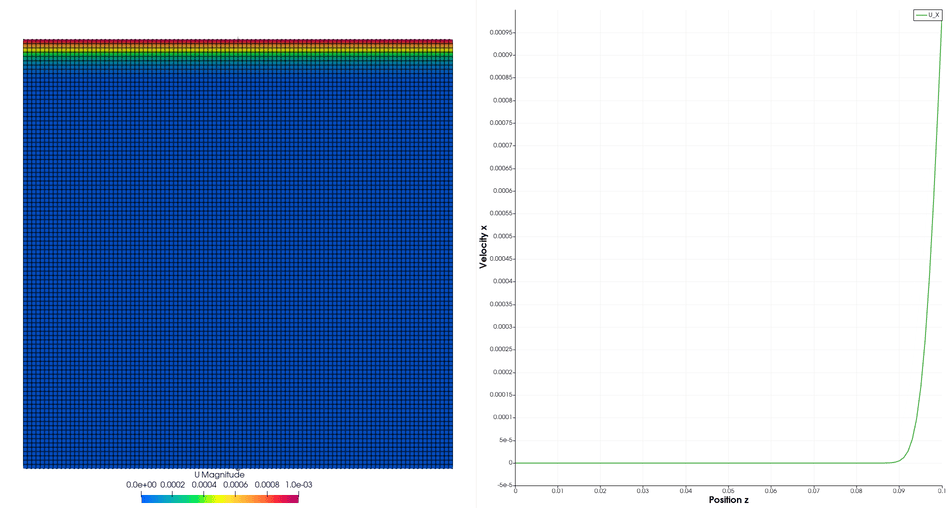

The velocity profile along the Z axis, once the flow is fully developed, can be plotted using the provided post-processing script:

.. code-block:: bash

   python3 ../hippoLBM/script/profile/plot_line_couette.py CouetteTestDir/Profile --nu 1e-3 --dt 6.666667e-05

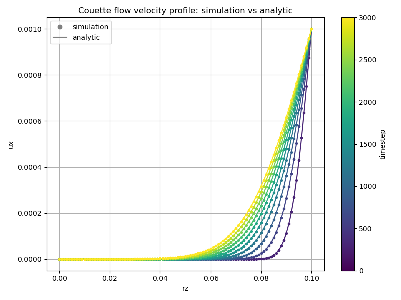

Lid-Driven Cavity Flow
^^^^^^^^^^^^^^^^^^^^^^

This example simulates a lid-driven cavity flow using the Lattice Boltzmann Method (LBM), set up to reach a Reynolds number of 1000. The domain resolution is 400×10×400, with bounds expressed in meters, and periodic boundary conditions applied along the YY axis, and non-periodic boundaries on the XX and ZZ axes.

.. code-block:: yaml

   do_domain:
     - domain:
        bounds:    [ [0 m, 0 m, 0 m],[0.01 m, 0.00025 m, 0.01 m] ]
        cell_dims: [ 400 , 10 , 400 ]
        periodic:  [ false, true, false ]

No external force is applied (`Fext = [0, 0, 0]`), the kinematic viscosity is set to `1e-5 m2.s-1`, the relaxation time `tau` is set to `0.7`, and the celerity (speed of sound used to convert real units to LBM units) is set to `10`.

.. code-block:: yaml

   set_lbm_parameters:
     - lbm_parameters:
        Fext: [0,0,0]
        nuth: 1e-5  # m2.s-1
        tau: 0.7
        celerity: 10

The collision model is set to BGK:

.. code-block:: yaml

   collision: bgk

Boundary conditions are applied using `lid_driven_cavity` in ``post_stream_bcs`` only. The moving lid with velocity `U = [1, 0, 0]` (Re = 1000) is applied on the upper XY plane (`plan_xy_l`). The three remaining non-periodic walls (`plan_xy_0`, `plan_yz_0`, `plan_yz_l`) are enforced as stationary walls by applying `lid_driven_cavity` with `U = [0, 0, 0]`.

.. code-block:: yaml

   post_stream_bcs:
     - lid_driven_cavity:
        U: [1, 0.0, 0]  ## Re : 1000
        regions: [plan_xy_l]
     - lid_driven_cavity:
        U: [0, 0.0, 0]
        regions: [plan_xy_0, plan_yz_0, plan_yz_l]

The expected result is a recirculating vortex driven by the moving lid at the top of the cavity, characteristic of the classical lid-driven cavity benchmark.

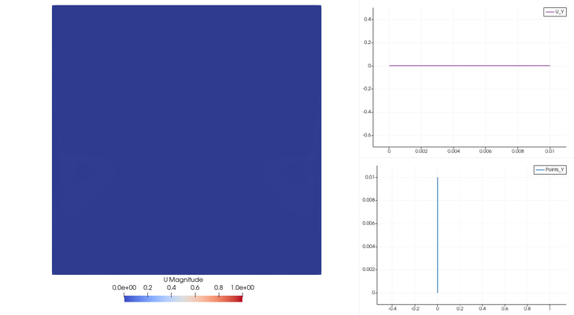

The velocity field once the flow has reached its steady state is shown below:

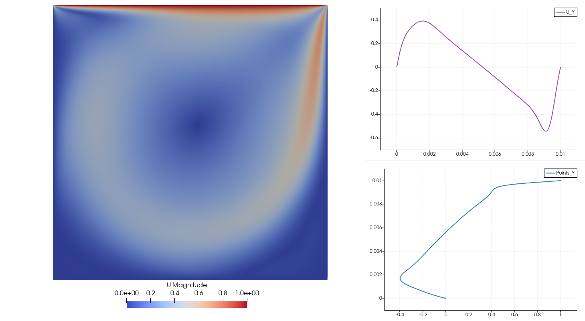

The centerline velocity profiles compared against the reference data of :cite:`ghia1982high` are shown below:

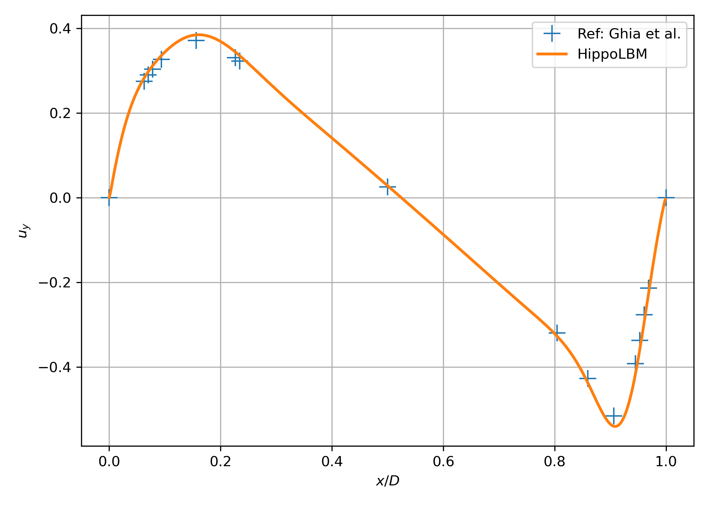

Karman Vortex Street
^^^^^^^^^^^^^^^^^^^^

This example simulates flow past a spherical obstacle using the Lattice Boltzmann Method (LBM). A body force drives the flow along the X axis. The domain is periodic in XX and YY, with non-periodic boundaries on the ZZ axis.

.. code-block:: yaml

   do_domain:
     - domain:
        bounds: [[0,0,0],[1.0,0.2,0.3]]
        cell_dims: [ 800, 160, 240 ]
        periodic: [true, true, false]

A body force of `1.3` along X drives the flow. The kinematic viscosity is `1e-3` and the relaxation time `tau` is set to `0.65`.

.. code-block:: yaml

   set_lbm_parameters:
     - lbm_parameters:
        Fext: [1.3, 0.0, 0.0]
        nuth: 1e-3
        tau: 0.65

The collision model is BGK:

.. code-block:: yaml

   collision: bgk

A **spherical obstacle** is placed off-center in the domain:

.. code-block:: yaml

   set_obstacles:
     - register_solid_ball:
        id: 0
        center: [0.1001, 0.1027, 0.15023]
        radius: 0.03

Neumann zero-velocity conditions are applied on both ZZ boundaries, and wall bounce-back handles the obstacle surface:

.. code-block:: yaml

   boundary_conditions:
     - neumann:
        U: [0,0,0]
        regions: [plan_xy_0, plan_xy_l]

   pre_stream_bcs:
     - wall_bounce_back

.. image:: ../_static/karman.gif
   :align: center

Flow Around Parametric Shapes
^^^^^^^^^^^^^^^^^^^^^^^^^^^^^

This example illustrates the use of **quadric surfaces** to define obstacles using the ``register_quadrics`` operator. Three shapes (cylinder, sphere, cone) are placed in the domain. The flow is driven by a body force along X, with periodic boundary conditions along XX and YY axes.

.. code-block:: yaml

   do_domain:
     - domain:
        bounds: [[0,0,0],[1.0,0.2,0.3]]
        cell_dims: [ 400, 80, 120 ]
        periodic: [true, true, false]

An external force of `1.3` along X drives the flow. The kinematic viscosity is `1e-3`, and the relaxation time `tau` is set to `0.65`:

.. code-block:: yaml

   set_lbm_parameters:
     - lbm_parameters:
        Fext: [1.3, 0.0, 0.0]
        nuth: 1e-3
        tau: 0.65

The collision model is set to BGK:

.. code-block:: yaml

   collision: bgk

Three quadric obstacles are registered using ``register_quadrics``. Each is defined by a named quadric type and a sequence of geometric transforms (``scale`` then ``translate``):

- ``cyly``: cylinder aligned along the Y axis
- ``sphere``: ellipsoid (sphere when scale is uniform)
- ``conez``: cone aligned along the Z axis

.. code-block:: yaml

   set_obstacles:
     - register_quadrics:
        id: 0
        quadrics: cyly
        transform:
          - scale:     [ 0.05, 1,    0.05 ]
          - translate: [ 0.15, 0.1,  0.1  ]
     - register_quadrics:
        id: 1
        quadrics: sphere
        transform:
          - scale:     [ 0.05, 0.08, 0.05 ]
          - translate: [ 0.35, 0.1,  0.15 ]
     - register_quadrics:
        id: 2
        quadrics: conez
        transform:
          - scale:     [ 0.05, 0.05, 0.05 ]
          - translate: [ 0.55, 0.1,  0.25 ]

Neumann zero-velocity conditions are applied on both ZZ boundaries, and wall bounce-back is applied on obstacle surfaces:

.. code-block:: yaml

   boundary_conditions:
     - neumann:
        U: [0,0,0]
        regions: [plan_xy_0, plan_xy_l]

   pre_stream_bcs:
     - wall_bounce_back

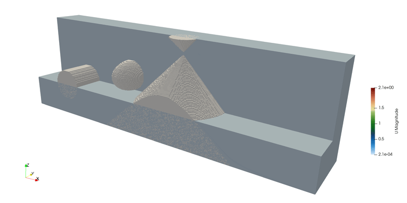

Pressure-Driven Flow
^^^^^^^^^^^^^^^^^^^^

This simulation demonstrates the effect of a strong pressure or density difference using the Lattice Boltzmann Method (LBM). The domain has a resolution of 100×100×100, with periodic boundary conditions along the Y axis, and closed boundaries in X and Z.

.. code-block:: yaml

   do_domain:
     - domain:
        bounds:    [ [0,0,0] , [0.1,0.1,0.1] ]
        cell_dims: [ 100 , 100 , 100 ]
        periodic:  [ false, true, false ]

No external force is applied. The kinematic viscosity is set to `1e-4`.

.. code-block:: yaml

   set_lbm_parameters:
     - lbm_parameters:
        Fext: [0.000000e+00,0.000000e+00,0.000000e+00]
        nuth: 1e-4

The **pre-streaming boundary conditions** include:

- `pre_bounce_back`: standard no-slip boundary on external walls.
- `wall_bounce_back`: bounce-back for internal structures.

.. code-block:: yaml

   pre_stream_bcs:
     - pre_bounce_back
     - wall_bounce_back

Two vertical **internal walls** are added near the center of the domain, one at the top and one at the bottom, leaving a gap in the middle. These walls obstruct flow and create more complex recirculation patterns.

.. code-block:: yaml

   set_obstacles:
     - register_solid_wall:
        id: 0
        bounds: [[0.048,0,0.06],[0.052,0.1,0.1]]
     - register_solid_wall:
        id: 1
        bounds: [[0.048,0,0],[0.052,0.1,0.04]]

A high-density region is initialized on the left-hand side using ``set_distribution`` with a coefficient of `1.5`. This creates a **pressure difference** between the left and right sides of the domain, acting as the flow-driving mechanism.

.. code-block:: yaml

   set_distributions:
     - set_distribution:
        value: 1.5
        bounds: [[0,0,0], [0.048,1,1]]

.. warning::

   The ``value`` parameter is applied uniformly to **all** distribution function components :math:`f_i`. This is a raw initialization of the distributions, not a thermodynamically consistent density initialization.

The **post-streaming boundary condition** is the standard `post_bounce_back`.

.. code-block:: yaml

   post_stream_bcs:
     - post_bounce_back

The goal of this setup is to observe how a **sharp pressure gradient** (from the initialized distribution) drives flow across the domain.

.. image:: ../_static/pressure.gif
   :align: center

Pressure-Driven Flow Through Complex Geometry
^^^^^^^^^^^^^^^^^^^^^^^^^^^^^^^^^^^^^^^^^^^^^

This simulation demonstrates pressure-driven flow across a complex internal structure using the Lattice Boltzmann Method (LBM). The domain is discretized with a resolution of 400×400×400, offering fine detail of the flow field. Periodic boundary conditions are applied along the Y axis, and the X and Z axes remain non-periodic.

.. code-block:: yaml

   do_domain:
     - domain:
        bounds:    [ [0,0,0] , [0.1,0.1,0.1] ]
        cell_dims: [ 400 , 400 , 400 ]
        periodic:  [false, true, false ]

No external force is applied (`Fext = [0,0,0]`), and the kinematic viscosity is set to `1e-4`.

.. code-block:: yaml

   set_lbm_parameters:
     - lbm_parameters:
        Fext: [0,0,0]
        nuth: 1e-4

**Pre-streaming boundary conditions** include bounce-back on all walls and user-defined internal walls:

.. code-block:: yaml

   pre_stream_bcs:
     - pre_bounce_back
     - wall_bounce_back

A **complex system of internal obstacles (walls)** is defined to create a tortuous path for the flow. These walls are strategically placed along the X axis to create narrow channels and mixing zones.

.. code-block:: yaml

   set_obstacles:
     - register_solid_wall:
        id: 0
        bounds: [[0.024,0,0.06],[0.026,0.1,0.1]]
     - register_solid_wall:
        id: 1
        bounds: [[0.024,0,0],[0.026,0.1,0.04]]
     - register_solid_wall:
        id: 2
        bounds: [[0.034,0,0.025],[0.036,0.1,0.075]]
     - register_solid_wall:
        id: 3
        bounds: [[0.049,0,0.06],[0.051,0.1,0.1]]
     - register_solid_wall:
        id: 4
        bounds: [[0.049,0,0],[0.051,0.1,0.04]]
     - register_solid_wall:
        id: 5
        bounds: [[0.068,0,0.0355],[0.072,0.1,0.065]]
     - register_solid_wall:
        id: 6
        bounds: [[0.085,0,0.02],[0.1,0.1,0.03]]
     - register_solid_wall:
        id: 7
        bounds: [[0.085,0,0.07],[0.1,0.1,0.08]]

A **high-density initialization** is imposed on the far left of the domain using ``set_distribution`` with a value of 1.5. This sets up a large **pressure difference** that drives the fluid flow.

.. code-block:: yaml

   set_distributions:
     - set_distribution:
        value: 1.5
        bounds: [[0,0,0], [0.024,1,1]]

.. warning::

   The ``value`` parameter is applied uniformly to **all** distribution function components :math:`f_i`. This is a raw initialization of the distributions, not a thermodynamically consistent density initialization.

**Post-streaming bounce-back** is applied to maintain no-slip conditions at the boundaries:

.. code-block:: yaml

   post_stream_bcs:
     - post_bounce_back

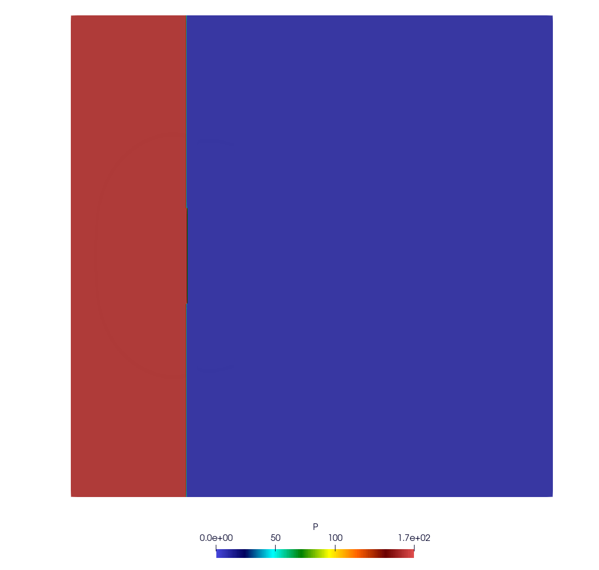

Cavity Flow [OLD]
^^^^^^^^^^^^^^^^^

We define the simulation domain for the cavity flow using the Lattice Boltzmann Method (LBM). In this case, the resolution is set to 200×200×200, with non-periodic boundary conditions applied in all directions (XX, YY, and ZZ).

.. code-block:: yaml

   do_domain:
     - domain:
        bounds:    [ [0,0,0] , [0.1,0.1,0.1] ]
        cell_dims: [ 200 , 200 , 200 ]
        periodic:  [ false, false, false ]

We set the Lattice Boltzmann parameters, with no external force applied (i.e., `Fext = [0, 0, 0]`) and a kinematic viscosity (`nuth`) of `1e-4`.

.. code-block:: yaml

   set_lbm_parameters:
     - lbm_parameters:
        Fext: [0.000000e+00,0.000000e+00,0.000000e+00]
        nuth: 1e-4

The boundary conditions for the simulation are defined as follows:

- **Pre-streaming boundary conditions**: The `pre_bounce_back` and `cavity_z_l` conditions are set, with a velocity of `U = [0.0, 0.1, 0]` applied on the lower Z boundary.
- **Post-streaming boundary condition**: The `post_bounce_back` condition is applied on the other boundaries.

.. code-block:: yaml

   pre_stream_bcs:
     - pre_bounce_back
     - cavity_z_l:
        U: [0.0, 0.1, 0]

   post_stream_bcs:
     - post_bounce_back

The expected results will show the development of a cavity flow pattern, where the fluid moves along the Z axis, influenced by the velocity set on the lower boundary. This is typical for cavity simulations, where the fluid is confined within a box.

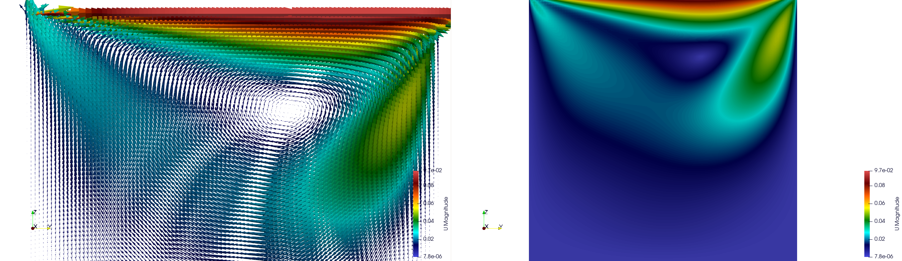

Cavity Flow with Wall Obstacle [OLD]
^^^^^^^^^^^^^^^^^^^^^^^^^^^^^^^^^^^^

This example simulates cavity flow using the Lattice Boltzmann Method (LBM) with a fixed obstacle (wall) in the middle of the domain. The domain resolution is 100×100×100, and non-periodic boundary conditions are enforced on all axes (XX, YY, and ZZ).

.. code-block:: yaml

   do_domain:
     - domain:
        bounds:    [ [0,0,0] , [0.1,0.1,0.1] ]
        cell_dims: [ 100 , 100 , 100 ]
        periodic:  [ false, false, false ]

No external force is applied (`Fext = [0, 0, 0]`), and the kinematic viscosity is set to `1e-4`.

.. code-block:: yaml

   set_lbm_parameters:
     - lbm_parameters:
        Fext: [0.000000e+00,0.000000e+00,0.000000e+00]
        nuth: 1e-4

Boundary conditions are applied as follows:

- **Pre-streaming**:

  - `pre_bounce_back` applies bounce-back on walls.
  - `cavity_z_l` sets a moving lid on the lower Z boundary with velocity `U = [0.1, 0.0, 0]`.
  - `wall_bounce_back` enables bounce-back condition for the internal obstacle.

- **Post-streaming**:

  - `post_bounce_back` finalizes bounce-back conditions after streaming.

.. code-block:: yaml

   pre_stream_bcs:
     - pre_bounce_back
     - cavity_z_l:
        U: [0.1, 0.0, 0]
     - wall_bounce_back

   post_stream_bcs:
     - post_bounce_back

An internal obstacle is defined using the ``set_obstacles`` field. A vertical wall is placed at the center of the domain, slightly offset in the X-direction, spanning from Z = 0 to Z = 0.08.

.. code-block:: yaml

   set_obstacles:
     - register_solid_wall:
        id: 0
        bounds: [[0.048,0,0],[0.052,0.1,0.08]]

The expected result is a modified cavity flow field with recirculation zones forming around the central wall obstacle, demonstrating how internal structures influence fluid dynamics in confined spaces.

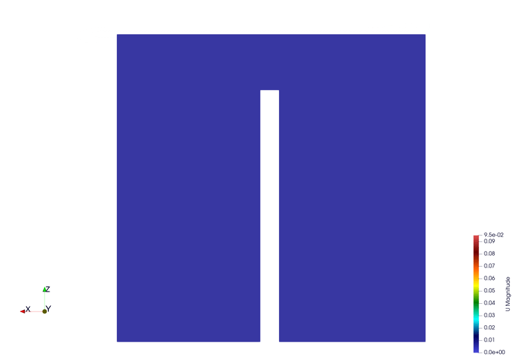