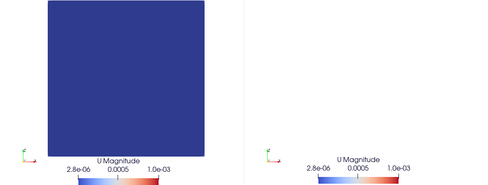

Examples
========

Poiseuille Flow
^^^^^^^^^^^^^^^

We define the simulation domain for the Lattice Boltzmann Method (LBM). In this example, we choose a resolution of 30×30×30. Periodic boundary conditions are applied along the XX and YY axes, while the ZZ axis remains non-periodic.

.. code-block:: yaml

   do_domain:
     - domain:
        bounds: [[0,0,0],[0.1,0.1,0.1]]
        resolution: 30
        periodic: [true, true, false]

We apply two Neumann boundary conditions on the Z axis, (setting to `(ux = 0, uy = 0, uz = 0)`):

.. code-block:: yaml

   boundary_conditions:
     - neumann_z_l:
        U: [0.0,0,0]
     - neumann_z_0:
        U: [0.0,0,0]

An external force of `(9.512485×10−5,0.0,0.0)` is applied to drive the flow. The kinematic viscosity is set to `1e−3`, and the average density is assumed to be `1000`.

.. code-block:: yaml

   set_lbm_parameters:
     - lbm_parameters:
        Fext: [9.512485e-05,0.000000e+00,0.000000e+00]
        nuth: 1e-3

The global parameters for this simulation include output frequency and the total number of iterations:

.. code-block:: yaml

   global:
      simulation_paraview_freq: 100
      simulation_end_iteration: 3000

The expected results should show the development of a fully developed Poiseuille flow profile along the Z axis, with velocity increasing towards the center and decreasing near the boundaries due to the imposed Neumann conditions.

.. image:: ../_static/lbmpoiseuille.gif
   :align: center

Couette Flow
^^^^^^^^^^^^

We define the simulation domain for the Couette flow using the Lattice Boltzmann Method (LBM). In this case, we set the resolution to 100×100×100, with periodic boundary conditions applied on the XX and YY axes, and non-periodic boundary on the ZZ axis.

.. code-block:: yaml

   do_domain:
     - domain:
        bounds: [[0,0,0],[0.1,0.1,0.1]]
        resolution: 100
        periodic: [true, true, false]

We set the Lattice Boltzmann parameters with a kinematic viscosity (`nuth`) of `1e-2` and no external force applied (i.e., `Fext = [0, 0, 0]`).

.. code-block:: yaml

   set_lbm_parameters:
     - lbm_parameters:
        Fext: [0.000000e+00,0.000000e+00,0.000000e+00]
        nuth: 1e-2

Boundary conditions are applied on the Z axis. On the lower boundary (`neumann_z_l`), the velocity is set to `U = [0.001, 0, 0]`.

.. code-block:: yaml

   boundary_conditions:
     - neumann_z_l:
        U: [0.001,0,0]

The expected results will show a linear velocity profile along the Z axis, where the velocity increases linearly from the stationary bottom boundary to the top boundary with a constant shear rate, characteristic of Couette flow.

Cavity Flow
^^^^^^^^^^^

We define the simulation domain for the cavity flow using the Lattice Boltzmann Method (LBM). In this case, the resolution is set to 200×200×200, with non-periodic boundary conditions applied in all directions (XX, YY, and ZZ).

.. code-block:: yaml

   do_domain:
     - domain:
        bounds: [[0,0,0],[0.1,0.1,0.1]]
        resolution: 200
        periodic: [false, false, false]

We set the Lattice Boltzmann parameters, with no external force applied (i.e., `Fext = [0, 0, 0]`) and a kinematic viscosity (`nuth`) of `1e-4`.

.. code-block:: yaml

   set_lbm_parameters:
     - lbm_parameters:
        Fext: [0.000000e+00,0.000000e+00,0.000000e+00]
        nuth: 1e-4

The boundary conditions for the simulation are defined as follows:

- **Pre-streaming boundary conditions**: The `pre_bounce_back` and `cavity_z_l` conditions are set, with a velocity of `U = [0.0, 0.1, 0]` applied on the lower Z boundary.
- **Post-streaming boundary condition**: The `post_bounce_back` condition is applied on the other boundaries.

.. code-block:: yaml

   pre_stream_bcs:
     - pre_bounce_back
     - cavity_z_l:
        U: [0.0, 0.1, 0]

   post_stream_bcs:
     - post_bounce_back

The expected results will show the development of a cavity flow pattern, where the fluid moves along the Z axis, influenced by the velocity set on the lower boundary. This is typical for cavity simulations, where the fluid is confined within a box.

Cavity Flow with Wall Obstacle
^^^^^^^^^^^^^^^^^^^^^^^^^^^^^^

This example simulates cavity flow using the Lattice Boltzmann Method (LBM) with a fixed obstacle (wall) in the middle of the domain. The domain resolution is 100×100×100, and non-periodic boundary conditions are enforced on all axes (XX, YY, and ZZ).

.. code-block:: yaml

   do_domain:
     - domain:
        bounds: [[0,0,0],[0.1,0.1,0.1]]
        resolution: 100
        periodic: [false, false, false]

No external force is applied (`Fext = [0, 0, 0]`), and the kinematic viscosity is set to `1e-4`.

.. code-block:: yaml

   set_lbm_parameters:
     - lbm_parameters:
        Fext: [0.000000e+00,0.000000e+00,0.000000e+00]
        nuth: 1e-4

Boundary conditions are applied as follows:

- **Pre-streaming**:

  - `pre_bounce_back` applies bounce-back on walls.
  - `cavity_z_l` sets a moving lid on the lower Z boundary with velocity `U = [0.1, 0.0, 0]`.
  - `wall_bounce_back` enables bounce-back condition for the internal obstacle.

- **Post-streaming**:

  - `post_bounce_back` finalizes bounce-back conditions after streaming.

.. code-block:: yaml

   pre_stream_bcs:
     - pre_bounce_back
     - cavity_z_l:
        U: [0.1, 0.0, 0]
     - wall_bounce_back

   post_stream_bcs:
     - post_bounce_back

An internal obstacle is defined using the `set_obstacles` field. A vertical wall is placed at the center of the domain, slightly offset in the X-direction, spanning from Z = 0 to Z = 0.08.

.. code-block:: yaml

   set_obstacles:
     - set_wall:
        bounds: [[0.048,0,0],[0.052,0.1,0.08]]

The expected result is a modified cavity flow field with recirculation zones forming around the central wall obstacle, demonstrating how internal structures influence fluid dynamics in confined spaces.

Pressure-Driven Flow
^^^^^^^^^^^^^^^^^^^^

This simulation demonstrates the effect of a strong pressure or density difference using the Lattice Boltzmann Method (LBM). The domain has a resolution of 100×100×100, with periodic boundary conditions along the Y axis, and closed boundaries in X and Z.

.. code-block:: yaml

   do_domain:
     - domain:
        bounds: [[0,0,0],[0.1,0.1,0.1]]
        resolution: 100
        periodic: [false, true, false]

No external force is applied. The kinematic viscosity is set to `1e-4`.

.. code-block:: yaml

   set_lbm_parameters:
     - lbm_parameters:
        Fext: [0.000000e+00,0.000000e+00,0.000000e+00]
        nuth: 1e-4

The **pre-streaming boundary conditions** include:

- `pre_bounce_back`: standard no-slip boundary on external walls.
- `wall_bounce_back`: bounce-back for internal structures.

.. code-block:: yaml

   pre_stream_bcs:
     - pre_bounce_back
     - wall_bounce_back

Two vertical **internal walls** are added near the center of the domain, one at the top and one at the bottom, leaving a gap in the middle. These walls obstruct flow and create more complex recirculation patterns.

.. code-block:: yaml

   set_obstacles:
     - set_wall:
        bounds: [[0.048,0,0.06],[0.052,0.1,0.1]]
     - set_wall:
        bounds: [[0.048,0,0],[0.052,0.1,0.04]]

A high-density region is initialized on the left-hand side using `init_distributions` with a coefficient of `1.5`. This creates a **pressure difference** between the left and right sides of the domain, acting as the flow-driving mechanism.

.. code-block:: yaml

   set_distributions:
     - init_distributions:
        tmp_coeff: 1.5
        bounds: [[0,0,0], [0.048,1,1]]

The **post-streaming boundary condition** is the standard `post_bounce_back`.

.. code-block:: yaml

   post_stream_bcs:
     - post_bounce_back

The goal of this setup is to observe how a **sharp pressure gradient** (from the initialized distribution) drives flow across the domain.

.. image:: ../_static/pressure.gif
   :align: center

Pressure-Driven Flow Through Complex Geometry
^^^^^^^^^^^^^^^^^^^^^^^^^^^^^^^^^^^^^^^^^^^^^

This simulation demonstrates pressure-driven flow across a complex internal structure using the Lattice Boltzmann Method (LBM). The domain is discretized with a resolution of 400×400×400, offering fine detail of the flow field. Periodic boundary conditions are applied along the Y axis, and the X and Z axes remain non-periodic.

.. code-block:: yaml

   do_domain:
     - domain:
        bounds: [[0,0,0],[0.1,0.1,0.1]]
        resolution: 400
        periodic: [false, true, false]

No external force is applied (`Fext = [0,0,0]`), and the kinematic viscosity is set to `1e-4`.

.. code-block:: yaml

   set_lbm_parameters:
     - lbm_parameters:
        Fext: [0,0,0]
        nuth: 1e-4

**Pre-streaming boundary conditions** include bounce-back on all walls and user-defined internal walls:

.. code-block:: yaml

   pre_stream_bcs:
     - pre_bounce_back
     - wall_bounce_back

A **complex system of internal obstacles (walls)** is defined to create a tortuous path for the flow. These walls are strategically placed along the X axis to create narrow channels and mixing zones.

.. code-block:: yaml

   set_obstacles:
     - set_wall:
        bounds: [[0.024,0,0.06],[0.026,0.1,0.1]]
     - set_wall:
        bounds: [[0.024,0,0],[0.026,0.1,0.04]]
     - set_wall:
        bounds: [[0.034,0,0.025],[0.036,0.1,0.075]]
     - set_wall:
        bounds: [[0.049,0,0.06],[0.051,0.1,0.1]]
     - set_wall:
        bounds: [[0.049,0,0],[0.051,0.1,0.04]]
     - set_wall:
        bounds: [[0.068,0,0.0355],[0.072,0.1,0.065]]
     - set_wall:
        bounds: [[0.085,0,0.02],[0.1,0.1,0.03]]
     - set_wall:
        bounds: [[0.085,0,0.07],[0.1,0.1,0.08]]

A **high-density initialization** is imposed on the far left of the domain using `init_distributions` with a `tmp_coeff` of 1.5. This sets up a large **pressure difference** that drives the fluid flow.

.. code-block:: yaml

   set_distributions:
     - init_distributions:
        tmp_coeff: 1.5
        bounds: [[0,0,0], [0.024,1,1]]

**Post-streaming bounce-back** is applied to maintain no-slip conditions at the boundaries:

.. code-block:: yaml

   post_stream_bcs:
     - post_bounce_back

