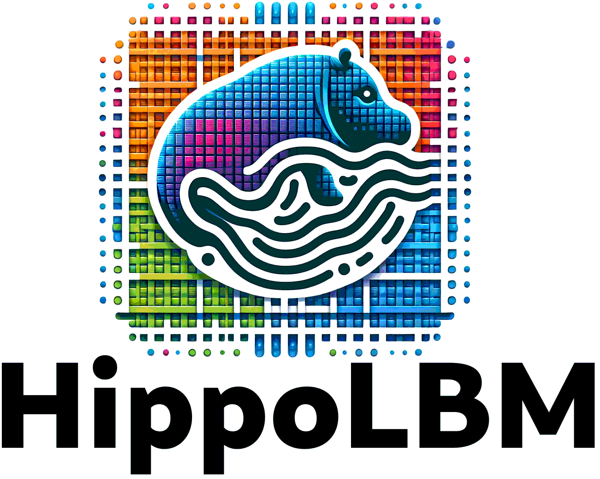

HippoLBM Software
=================

Overview of HippoLBM
^^^^^^^^^^^^^^^^^^^^

``HippoLBM`` is a high-performance Lattice Boltzmann Method (LBM) simulation code developed in ``C++`` and built on the ``Onika`` runtime. It is designed for large-scale fluid dynamics simulations and features a parallelization strategy to maximize computational efficiency. ``HippoLBM`` integrates hybrid ``MPI`` + ``OpenMP`` parallelism for ``CPU`` execution and ``CUDA`` acceleration for ``GPU`` architectures, ensuring scalability across different hardware configurations.

One of ``HippoLBM``’s key strengths is its ability to couple with other physics solvers, enabling multiphysics simulations. With a focus on modularity and extensibility, ``HippoLBM`` provides researchers and engineers with a flexible and efficient tool for tackling complex fluid dynamics problems in high-performance computing environments.

Historically, the physical features of ``HippoLBM`` originate from earlier work on coupling the Lattice Boltzmann Method (LBM) with the Discrete Element Method (DEM) to simulate granular flows immersed in a viscous fluid. This LBM/DEM coupling was developed and used in a series of publications, in particular during Lhassan Amarsid's PhD thesis :cite:`amarsid2015rheologie`, with results published, for example, in :cite:`amarsid2017viscoinertial`.

Coupling
^^^^^^^^

- ``HippoLBM`` is currently being coupled with the ``exaDEM`` code :cite:`prat2025exadem` (built on the ``ExaNBody``/``Onika`` framework :cite:`Carrard_2024`) in a dedicated code named ``ExaCoLD`` (not open source).