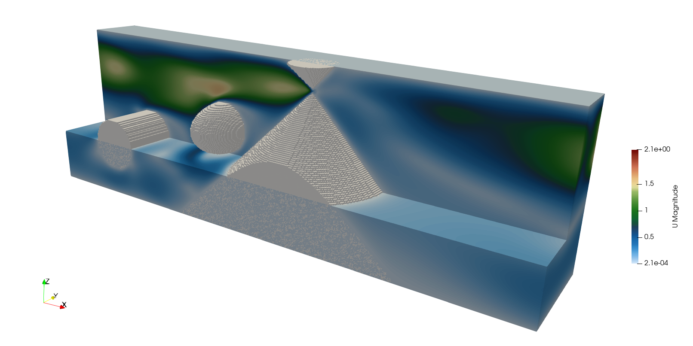

Obstacles
=========

Obstacles are solid bodies placed inside the simulation domain. They are registered in the ``set_obstacles`` block before the simulation starts. Each operator adds one obstacle to the list and requires a unique integer ``id``. Obstacle surfaces enforce the no-slip condition through ``wall_bounce_back`` in ``pre_stream_bcs``.

.. code-block:: yaml

   pre_stream_bcs:
     - wall_bounce_back

Solid Wall
^^^^^^^^^^

- Operator Name: ``register_solid_wall``
- Description: Registers an axis-aligned box (AABB) as a solid obstacle.
- Parameters:

  - ``id``: Unique integer identifier for this obstacle.
  - ``bounds``: Axis-aligned bounding box ``[[xmin, ymin, zmin], [xmax, ymax, zmax]]``.

YAML example:

.. code-block:: yaml

   set_obstacles:
     - register_solid_wall:
        id: 0
        bounds: [[0.048, 0, 0], [0.052, 0.1, 0.08]]

Solid Ball
^^^^^^^^^^

- Operator Name: ``register_solid_ball``
- Description: Registers a spherical obstacle defined by a center and a radius.
- Parameters:

  - ``id``: Unique integer identifier for this obstacle.
  - ``center``: Position of the sphere center ``[x, y, z]``.
  - ``radius``: Radius of the sphere.

YAML example:

.. code-block:: yaml

   set_obstacles:
     - register_solid_ball:
        id: 0
        center: [0.1, 0.05, 0.1]
        radius: 0.013

Quadric Surface
^^^^^^^^^^^^^^^

- Operator Name: ``register_quadrics``
- Description: Registers a quadric surface obstacle. A quadric is defined by a named canonical shape and an optional sequence of geometric transforms (``scale`` and/or ``translate``) that are composed in order. A point ``p`` is inside the obstacle if ``Q(T⁻¹ p) ≤ 0`` where ``Q`` is the canonical quadric matrix and ``T`` is the composed transform.
- Parameters:

  - ``id``: Unique integer identifier for this obstacle.
  - ``quadrics``: Name of the canonical quadric shape. Available shapes:

    - ``sphere``: unit sphere (also used as ellipsoid via non-uniform scaling)
    - ``cyly``: cylinder aligned along the Y axis
    - ``cylx``: cylinder aligned along the X axis
    - ``cylz``: cylinder aligned along the Z axis
    - ``conez``: cone aligned along the Z axis

  - ``transform`` (optional): List of transforms applied in order. Each entry is either:

    - ``scale: [sx, sy, sz]``
    - ``translate: [tx, ty, tz]``

YAML example:

.. code-block:: yaml

   set_obstacles:
     - register_quadrics:
        id: 0
        quadrics: cyly
        transform:
          - scale:     [ 0.05, 1,    0.05 ]
          - translate: [ 0.15, 0.1,  0.1  ]
     - register_quadrics:
        id: 1
        quadrics: sphere
        transform:
          - scale:     [ 0.05, 0.08, 0.05 ]
          - translate: [ 0.35, 0.1,  0.15 ]
     - register_quadrics:
        id: 2
        quadrics: conez
        transform:
          - scale:     [ 0.05, 0.05, 0.05 ]
          - translate: [ 0.55, 0.1,  0.25 ]

STL Mesh (RShape)
^^^^^^^^^^^^^^^^^

- Operator Name: ``register_rshape``
- Description: Loads an arbitrary triangulated surface from an STL file (binary or ASCII) and registers it as a solid obstacle. The mesh is first scaled, then rotated (via a quaternion), then translated. A Minkowski radius can be specified to add a uniform offset around the surface, rounding sharp edges.
- Parameters:

  - ``id``: Unique integer identifier for this obstacle.
  - ``filename``: Path to the STL file (binary or ASCII).
  - ``center`` *(optional)*: Translation applied after scaling and rotation ``[tx, ty, tz]`` (default: ``[0, 0, 0]``).
  - ``scale`` *(optional)*: Uniform scale factor applied before rotation (default: ``1.0``).
  - ``orientation`` *(optional)*: Rotation as a quaternion ``[w, x, y, z]`` applied after scaling (default: identity ``[1, 0, 0, 0]``).
  - ``minkowski`` *(optional)*: Rounding radius — a point is inside the obstacle if it lies within this distance of any face (default: ``0.0``).

.. note::

   Transform order is: **scale → rotate → translate**. STL coordinates are in physical units.

YAML example:

.. code-block:: yaml

   set_obstacles:
     - register_rshape:
        id: 0
        filename: "my_shape.stl"
        center:      [0.15, 0.05, 0.05]
        scale:       0.01
        orientation: [1, 0, 0, 0]   # identity [w,x,y,z]
        minkowski:   0.001
