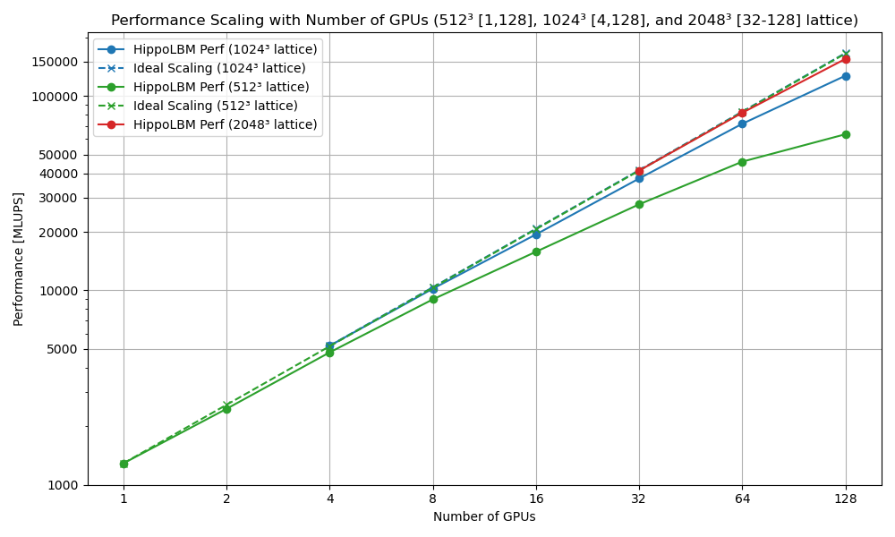

Performance
===========

In this section, we will highlight the current performance of the hippoLBM code on simple benchmarks. These results are bound to improve over time as we continue to optimize our products.

LBM Couette
^^^^^^^^^^^

Input File:

.. code-block:: bash

  do_domain:
    - domain:
       bounds: [[0,0,0],[0.1,0.1,0.1]]
       resolution: 256
       periodic: [true, true, false]

  set_lbm_parameters:
    - lbm_parameters:
       Fext: [0,0,0]
       nuth: 1e-2

  boundary_conditions:
    - neumann_z_l:
       U: [0.001,0,0]

  global:
     simulation_paraview_freq: -1
     simulation_print_log_freq: 1000
     simulation_end_iteration: 1000

Overall Performance On a CCRT node
----------------------------------

The benchmarks were performed on a high-performance computing system composed of several types of nodes:

- 864 standard compute nodes, each featuring 2 AMD EPYC Milan 7763 CPUs running at 2.45 GHz, providing 128 cores per node and 256 GB of RAM. In total, these nodes offer 110,592 CPU cores. The peak theoretical performance of this partition is approximately 4.5 Pflops, connected via an InfiniBand HDR-100 interconnect (12.5 GB/s bandwidth).

- 48 hybrid compute nodes, also equipped with 2 AMD EPYC Milan 7763 CPUs at 2.45 GHz and 128 cores per node, but with 512 GB of RAM and 4 Nvidia A100 GPUs per node. This hybrid partition delivers a peak performance of around 4.3 Pflops, with a faster InfiniBand HDR interconnect (25 GB/s bandwidth).

First of all, we'd like to evaluate the performance of hippoLBM on each of the two types of node (CPU and GPU). To do this, we will use 5 approaches: 

- ``Seq``: an MPI process with an openMP thread. This calculation serves as a baseline.
- ``OMP``: an MPI process with 128 openMP threads. 
- ``MPI``: 128 MPI processes with 1 openMP thread per MPI process. 
- ``Hybrid``: 16 MPI processes with 16 openMP threads per MPI process. This makes it possible to assign one numa node per MPI process, thus limiting NUMA effects while limiting the total number of MPI communications versus the MPI strategy.
- ``GPU``: 1 GPU and 32 cores per MPI process. OpenMP threads are hardly used.

To do this, we plot the number of MLUPS (Million Lattice Units Processed per Second) for 4 domain sizes: 64³, 128³, 256³ and 512³.

Here are the results obtained for the ``compute_loop`` section (without paraview output):

Here are the same results with a log scale for greater clarity.

Some comments:

- First of all, it should be noted that no Z or Hilbert-type optimization is used to optimize code on GPU versions. In addition, we could add a cache blocking method to optimize the OMP version when hippoLBM uses several NUMA nodes. All this non-optimization partly explains the poor performance of the OMP version. We justify this choice because we're aiming for Hybrid optmization to avoid NUMA effects, and we want to avoid burdening the code with cache blocking methods only for OpenMP.

- Although the MPI version outperforms the OMP version, it suffers from a large number of MPI communications during the streaming phase versus the workload, a phenomenon partly reduced by the hybrid version. Note that future optimization will involve performance recovery. A second reason is a bandwidth limit during the streaming phase (2*9 memory swaps per lattice);

- We note that a certain domain size is required to use the GPU at full power (64³ and 128³ versus 256 and 512);

- The GPU version outperforms the other versions, although it's true that a CPU versus GPU comparison is barely relevant. We compare the gains made using a complet GPU node with a complet CPU node on the CCRT/topaze supercomputer. In this case, we observed a speedup of 23,3 for this simulation over a domain of 512³. This speedup is drasticly reduced for small domain sizes.

Now we focus on the impact of MPI parallelization on the performance of the GPU version over on sufficiently large domain sizes.. Note that hippoLBM uses "CUDA aware MPI" capabilities to optimize memory transfers. We plot performance as a function of the number of MPI processes at a fixed domain size. 

.. note::

  512³ = 134,217,728 
  1024³ = 1,073,741,824
  2048³ = 8,589,934,592

- MPI communications seem inexpensive for these domain sizes;
- We have also see that the memory limits of the a100 GPUs (80GB) are reached for these examples, and that when this size is exceeded, the unified memory goes back and forth in the CPU RAM. This is why we skipped these points, as the simulation times were too long.
- We also run this simulation with a domain size of 4096³ (or 68.7 billions) over 192 GPUs. MLUPS =  2.48e+05 or 248 BLUPS.

To dig deeper, we'll look at the trace obtained via nsight-system and the roofline from nsigh-compute.

Trace On GPU
------------

Nsight System command line: 

.. code-block:: bash

   ccc_mprun -n 1 -c 32 -T 600 -Q test -p a100 nsys profile --stats=true -t nvtx,cuda -o trace ./hippoLBM ../perf/perf_couette_256x256x256.msp

Here is the trace obtained for a domain size of 256³. We focus on one time step because all time steps have the same trend. 

Here are a few important points:

- Each time step consists of a call to MacroVariables to retrieve macro data such as density, Collision BGK, a streaming phase and then the addition of Neumann boundary conditions.
- The streaming phase consists of two steps, with ghost updates. Note that in our case, only the periodic conditions are copied into the ghost zones.
- Other purely GPU-based LBM codes can afford to perform all 4 steps in a single kernel.
- We could merge some kernels too, but for greater flexibility (changing the order of operators) we'd like to avoid this type of optimization.

Comments: 

- the Neumann kernel is negligible;
- ``hippoLBM`` is designed for MPI+GPU, so we recommend using a copy buffer to update ghost zones while it's costly;
- streaming phase takes 50-55% of a time iteration step.

Roofline
--------

Nsight Compute command line: 

.. code-block:: bash

   ccc_mprun -n 1 -c 32 -p a100 ncu --set full -f -o full ./hippoLBM ../perf/perf_couette_256x256x256.msp

These three kernels are Pointwise operations, meaning that the same kernel is applied in the same way at each point, independently of the other points. Note that these operations are memory bounds, so it might be interesting to reduce the precision of certain arrays (double -> float, or int to int8_t or int4_t) to speed up calculations. 

Note that the Neumann kernel is relatively distant from the roof, due to the fact that it is only applied to a subset of points (a surface, 1/256 of other kernels), which is not enough to power the kernel. As this kernel is not long (1<<1% of total time), there's no point in dwelling on it.

The kernels (step1, step2) making up the stream consist of sucessive swaps, so they have no arithmetic intensity and can't be represented on a roofline. We'll add the data provided by nsight compute's speedoflight to give an overview of performance.

Remember that step1 consists of a swap between two reverse directions of the same LBM lattice, while step2 swaps between reverse directions of two neighboring lattices.

   +-----------------------+-----------------------------+-------------+
   | Kernel                | Compute (SM) Throughput [%] | Memory [%]  |
   +=======================+=============================+=============+
   | Macro_Variables       | 26.47                       | 80.26       |
   +-----------------------+-----------------------------+-------------+
   | BGK (Collision)       | 46.31                       | 71.97       |
   +-----------------------+-----------------------------+-------------+
   | Streaming (step1)     | 5.19                        | 81.55       |
   +-----------------------+-----------------------------+-------------+
   | Streaming (step2)     | 12.57                       | 74.85       |
   +-----------------------+-----------------------------+-------------+
   | Neumann               | 7.82                        | 39.35       |
   +-----------------------+-----------------------------+-------------+

Although no threshold is a reference, in practice we consider that between 70 and 80% of memory is a good percentage, and over 80% is very good.

