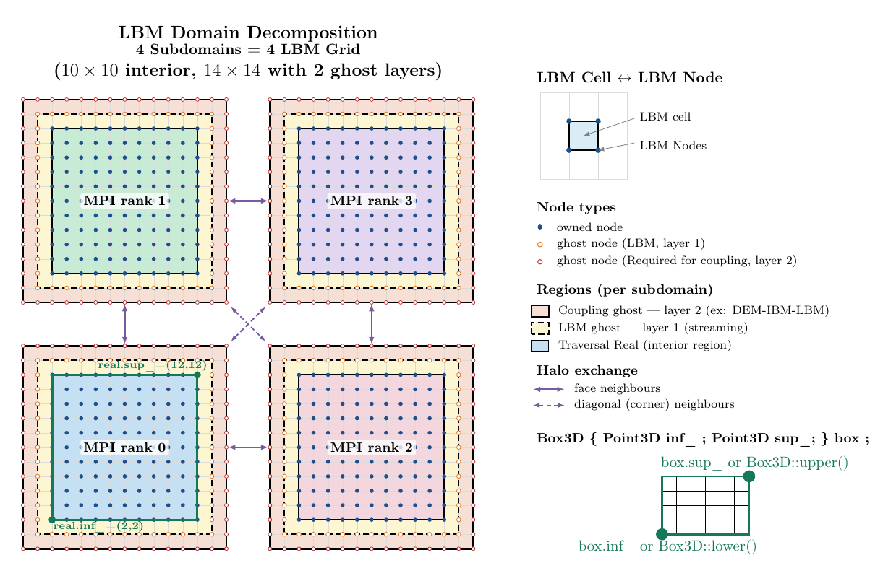
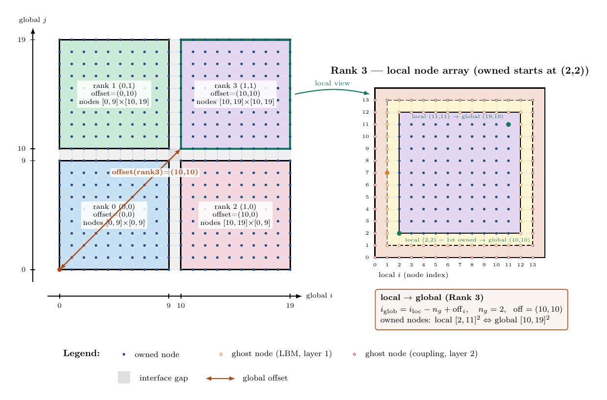
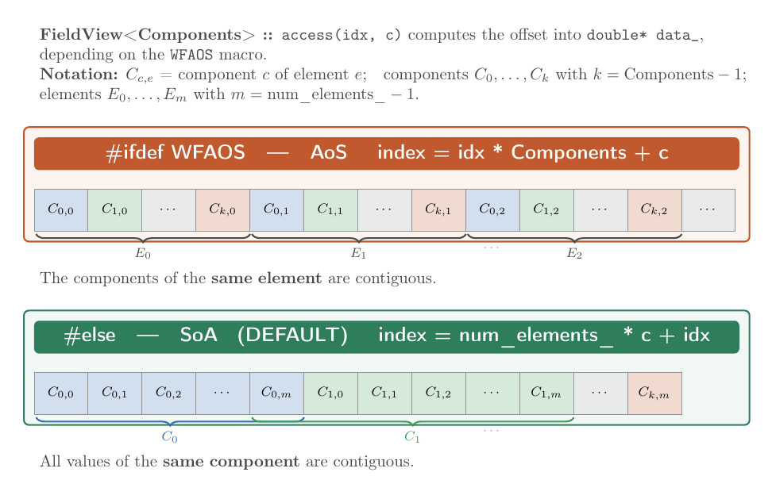

Domain, Grid, and Data Structures
==================================

This page describes the core data structures used internally by ``HippoLBM`` to represent the simulation domain, the discrete grid, and the distribution functions.
The figure below gives a schematic 2D representation of the LBM domain split across MPI subdomains. A grid is associated with each subdomain, and a set of predefined ``Box3D`` regions or identified ``Traversal`` with tags (``All``, ``Real``, ``Inside``, ``Extend``) — delimit zones such as the real cells, ghost layers, and extended areas.

LBMDomain
^^^^^^^^^

``LBMDomain<Q>`` is the top-level structure passed to all operators. It holds both global domain information — the physical bounding box (``bounds_``) and the full computational box (``m_box_``) — and local subdomain information: the position of this MPI process within the decomposition (``MPI_coord_``), its local grid (``m_grid_``), and the ghost-cell manager (``m_ghost_manager_``). It aggregates:

*Global domain information:*

- ``bounds_``: physical ``AABB`` (axis-aligned bounding box) of the full domain
- ``box_``: computational ``Box3D`` of the full domain including ghost layers
- ``domain_size_``: total number of real nodes per dimension

*Local subdomain information:*

- ``grid_``: the local ``LBMGrid`` for this MPI process
- ``ghost_manager_``: handles MPI ghost-cell communication
- ``MPI_coord_``: Cartesian coordinates of this process in the MPI grid
- ``MPI_grid_size_``: shape of the MPI process grid

The figure below illustrates the local/global index relationship for a 2×2 MPI decomposition.
Each rank stores a local array that includes ``ghost_layer_`` = 2 ghost layers on each side, so local owned indices start at 2.
The ``offset_`` of a subdomain is the global index of its first owned node. Interface nodes at subdomain boundaries (e.g. global ``i = 10``) are shared between adjacent ranks and are duplicated in both local arrays.

**Key methods**

- ``dx()``: returns the uniform grid spacing ``dx_``
- ``grid()``: returns a reference to the local ``LBMGrid``
- ``box()``: returns a reference to the local computational ``Box3D``
- ``bounds()``: returns a reference to the physical ``AABB`` of the full domain
- ``ghost_manager()``: returns a reference to the ``LBMGhostManager``
- ``size()``: returns the number of real nodes per dimension (without ghost layers)

**YAML operator: ``domain``**

The ``domain`` operator initializes an ``LBMDomain`` at the start of the simulation. It performs the MPI domain decomposition and sets up all grids and ghost layers. It is placed in the ``do_domain`` block.

Input slots:

- ``cell_dims`` *(required)*: number of cells in each dimension — the number of nodes is ``cell_dims + 1``. The grid spacing ``dx`` is computed from ``bounds`` and ``cell_dims``, and must be uniform in all directions.
- ``bounds`` *(required)*: physical bounding box of the full domain ``[[xmin, ymin, zmin], [xmax, ymax, zmax]]``, with optional unit suffix (e.g. ``m``).
- ``periodic`` *(required)*: list of three booleans controlling periodicity along X, Y, Z.

.. code-block:: yaml

   do_domain:
     - domain:
        bounds:    [ [0,0,0], [0.1,0.1,0.1] ]
        cell_dims: [ 100, 100, 100 ]
        periodic:  [ true, true, false ]

LBMGrid
^^^^^^^

``LBMGrid`` is the core per-subdomain grid structure. It stores:

- ``bx_``: ``Box3D`` of the local grid (real cells + ghost layers)
- ``ext_``: ``Box3D`` of the extended grid (used for streaming stencil)
- ``offset_``: ``Point3D`` offset of this subdomain within the global grid
- ``ghost_layer_``: number of ghost layers (default: 2)
- ``dx_``: uniform grid spacing (same in all directions)
- ``origin_``: physical origin of the global domain

**Traversal zones**

The grid is subdivided into nested regions controlled by the ``Traversal`` template parameter:

.. list-table::
   :header-rows: 1
   :widths: 20 80

   * - Traversal
     - Description
   * - ``All``
     - Full local box ``bx_`` (real cells + ghost layers)
   * - ``Real``
     - Real cells only (excludes ``ghost_layer_`` on each side)
   * - ``Inside``
     - Interior cells (excludes ghost layer + 1 additional layer)
   * - ``Extend``
     - Extended box ``ext_``: real nodes plus first-level ghost nodes that are active — i.e. nodes that belong to a neighbouring subdomain (communicated via MPI) or that correspond to periodic boundary images

The ``Area`` parameter controls whether indices are expressed in the **local** subdomain frame or the **global** domain frame:

- ``Area::Local``: coordinates relative to this subdomain
- ``Area::Global``: coordinates relative to the full domain (adds ``offset_``)
- ``Area::AsIs``: no conversion — coordinates are passed through as-is, used to avoid redundant shifts when the caller already works in the target frame

**Key methods**

- ``start<Area, Traversal>(dim)`` / ``end<Area, Traversal>(dim)``: bounds along a dimension
- ``build_box<Area, Traversal>()``: returns the corresponding ``Box3D``
- ``contains<Area, Traversal>(p)``: point membership test
- ``convert<Area>(p)``: converts a point between local and global frames
- ``project_to_grid<Area>(Vec3d)``: maps a physical position to a grid index
- ``compute_position<Area>(i, j, k)``: maps grid indices to physical coordinates
- ``restrict_box_to_grid<Area, Traversal>(box)``: clips a box to the subdomain

Fields and FieldView
^^^^^^^^^^^^^^^^^^^^^

``LBMFields<Q>`` stores all per-node data arrays as GPU-compatible contiguous vectors:

.. list-table::
   :header-rows: 1
   :widths: 20 15 65

   * - Member
     - Accessor
     - Description
   * - ``f_``
     - ``distributions()``
     - Distribution functions :math:`f_i`, ``Q`` components per node, accessed via ``FieldView<Q>``
   * - ``m0_``
     - ``densities()``
     - Macroscopic density :math:`\rho`, one scalar per node
   * - ``m1_``
     - ``flux()``
     - Macroscopic flux :math:`\rho \mathbf{u}`, 3 components per node, accessed via ``FieldView<3>``
   * - ``obst_``
     - ``obstacles()``
     - Obstacle marker per node (integer id, 0 = fluid)

``FieldView<Components>`` is a lightweight GPU/CPU-compatible view over a field array. It exposes a single accessor ``f(idx, c)`` that computes the flat offset into the underlying ``double* data_`` pointer depending on the memory layout selected at compile time:

- **Structure of Arrays** (default, ``#else``): ``index = num_elements_ * c + idx`` — all values of the same component are contiguous
- **Array of Structures** (``#ifdef WFAOS``): ``index = idx * Components + c`` — all components of the same node are contiguous

The SoA layout is preferred on GPU for coalesced memory access over components; AoS can be more cache-friendly for operations that process all components of a single node. ``FieldView<Q>`` is the object passed to all compute kernels.

.. warning::

   ``FieldView<N>`` always operates on ``double`` arrays. The template parameter ``N`` only controls the number of components per element; the scalar type is fixed to ``double``.

Lattice Scheme
^^^^^^^^^^^^^^

In LBM, the velocity space is discretized into a finite set of ``Q`` directions :math:`\mathbf{e}_i`, each associated with a weight :math:`w_i` satisfying the isotropy conditions of the lattice.
The distribution functions :math:`f_i` are advected along these directions during the streaming step, and relaxed toward a local equilibrium during the collision step.

``LBMScheme<Q>`` encodes a specific lattice: it defines the ``Q`` directions as a compile-time tuple of ``Direction`` types, each storing :math:`(e_x, e_y, e_z, w_i, \text{iopp})` — the velocity components, the weight, and the index of the opposite direction used in bounce-back.

.. warning::

   Only the D3Q19 scheme is currently implemented and tested. The core structures (``LBMDomain``, ``LBMGrid``, ``LBMFields``, ``FieldView``) are all templated on ``Q``, so adding a new scheme (e.g. D3Q27) would be straightforward in principle — the main effort lies in implementing the boundary conditions for the new stencil.

The D3Q19 scheme (``LBMScheme<19>``) uses 19 discrete velocities with weights :math:`w_0 = 1/3`, :math:`w_{1\text{–}6} = 1/18`, and :math:`w_{7\text{–}18} = 1/36`. Each direction stores its opposite index ``iopp`` used during bounce-back:

.. list-table::
   :header-rows: 1
   :widths: 8 12 12 12 15 10

   * - Index
     - :math:`e_x`
     - :math:`e_y`
     - :math:`e_z`
     - :math:`w_i`
     - ``iopp``
   * - 0
     - 0
     - 0
     - 0
     - 1/3
     - 0
   * - 1
     - +1
     - 0
     - 0
     - 1/18
     - 2
   * - 2
     - −1
     - 0
     - 0
     - 1/18
     - 1
   * - 3
     - 0
     - +1
     - 0
     - 1/18
     - 4
   * - 4
     - 0
     - −1
     - 0
     - 1/18
     - 3
   * - 5
     - 0
     - 0
     - +1
     - 1/18
     - 6
   * - 6
     - 0
     - 0
     - −1
     - 1/18
     - 5
   * - 7
     - +1
     - +1
     - 0
     - 1/36
     - 8
   * - 8
     - −1
     - −1
     - 0
     - 1/36
     - 7
   * - 9
     - +1
     - −1
     - 0
     - 1/36
     - 10
   * - 10
     - −1
     - +1
     - 0
     - 1/36
     - 9
   * - 11
     - +1
     - 0
     - +1
     - 1/36
     - 12
   * - 12
     - −1
     - 0
     - −1
     - 1/36
     - 11
   * - 13
     - +1
     - 0
     - −1
     - 1/36
     - 14
   * - 14
     - −1
     - 0
     - +1
     - 1/36
     - 13
   * - 15
     - 0
     - +1
     - +1
     - 1/36
     - 16
   * - 16
     - 0
     - −1
     - −1
     - 1/36
     - 15
   * - 17
     - 0
     - +1
     - −1
     - 1/36
     - 18
   * - 18
     - 0
     - −1
     - +1
     - 1/36
     - 17

The stencil utility ``hippoLBM::stencil::for_each<LBMScheme<19>>(f)`` iterates over all directions at compile time, calling ``f.template operator()<dir<iLB>>(iLB)`` for each index ``iLB``.

Point3D
^^^^^^^

``Point3D`` is a simple integer triplet ``(i, j, k)`` used for all discrete grid coordinates. It supports arithmetic operations (addition, subtraction) with other ``Point3D`` instances and can be implicitly converted to a floating-point ``Vec3d``.

.. code-block:: cpp

   hippoLBM::Point3D p = {10, 5, 3};
   int i = p[0]; // 10

Box3D
^^^^^

``Box3D`` represents an axis-aligned integer box defined by two corners:

- ``inf_``: the lower corner (inclusive)
- ``sup_``: the upper corner (inclusive)

It provides:

- ``get_length(dim)``: number of grid points along a dimension
- ``number_of_points()``: total number of points in the box
- ``operator()(x, y, z)`` → flat linear index (row-major: X fastest)
- ``operator()(idx)`` → ``Point3D`` from a flat index
- ``contains(p)``: checks whether a point lies inside the box
- ``intersect(a, b)``: checks whether two boxes overlap

Operator Slot Summary
^^^^^^^^^^^^^^^^^^^^^

The table below lists all major structures exchanged between operators through the Onika slot system, with their canonical slot name as used in the YAML configuration.

.. list-table::
   :header-rows: 1
   :widths: 28 18 54

   * - C++ type
     - Slot name
     - Description
   * - ``LBMDomain<Q>``
     - ``domain``
     - Top-level domain: grid, bounds, MPI decomposition, ghost manager (see `LBMDomain`_)
   * - ``LBMFields<Q>``
     - ``fields``
     - Per-node data arrays: distribution functions :math:`f_i`, density :math:`\rho`, flux :math:`\rho\mathbf{u}`, obstacle markers (see `Fields and FieldView`_)
   * - ``LBMGridRegion``
     - ``grid_region``
     - Traversal index arrays built by ``build_traversal``: ``real_``, ``inside_``, ``extend_``, face planes (``plane_xy_0_``, ``plane_xz_0_``, …)
   * - ``LBMParameters``
     - ``Params``
     - LBM simulation parameters computed by ``lbm_parameters``: ``tau_``, ``nu_``, ``dtLB_``, ``celerity_``, ``Fext_``, ``avg_rho_``
   * - ``Obstacles``
     - ``obstacles``
     - Collection of registered solid shapes (``Ball``, ``Wall``, ``Quadric``, ``RShape``) used to mark obstacle nodes in ``LBMFields::obst_``
